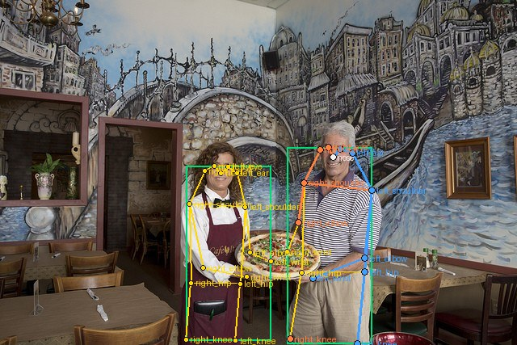
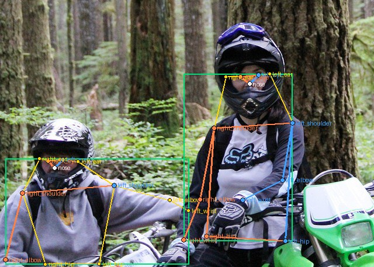
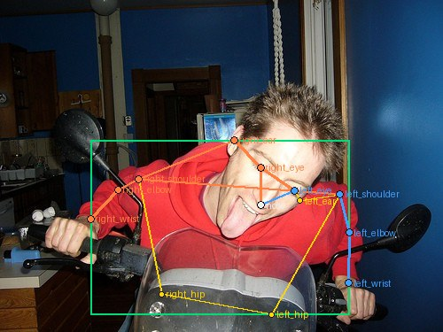
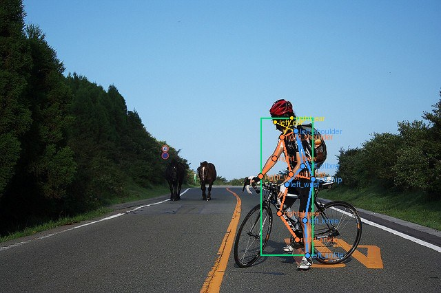
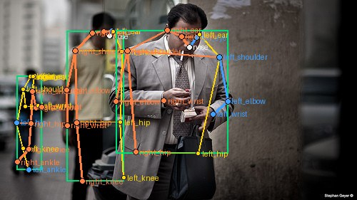

# Mini guideline - nhóm: Cá nhân (L2-L3 K4P1) | người gán: Cù Đức Quang | ngày: 2026-09-16

## 1. Luật bắt buộc

- Dùng đúng bộ 17 keypoint COCO và đúng thứ tự trong skeleton chung.
- Mỗi người có đủ 17 keypoint. Khớp không nhìn thấy vẫn giữ trong skeleton và gán visibility thích hợp.
- Trái/phải tính theo cơ thể người, không theo phía của ảnh.
- Bị che nhưng còn trong khung: đặt điểm ước lượng và gán `v=1` (Occluded).
- Ra ngoài mép ảnh: gán `v=0` (Outside), không đặt điểm giả trong ảnh.
- Không dùng Hidden (`h`) vì trạng thái này không được xuất đúng như visibility của bài lab.

## 2. Luật dùng trong bài cá nhân

| Tình huống | Luật đã dùng | Lý do | Ảnh minh họa |
| --- | --- | --- | --- |
| Hông của người mặc quần áo dài | Nếu đường hông bị vải che nhưng vẫn nằm trong ảnh, đặt điểm theo trục vai-knee và chọn `v=1`; chỉ chọn `v=2` khi mốc hông nhìn thấy rõ. | Quần áo che bề mặt giải phẫu nhưng không làm khớp ra khỏi ảnh. |  |
| Tai bị tóc hoặc mũ bảo hiểm che | Nếu không thấy rõ tâm tai do tóc/mũ nhưng đầu còn trong ảnh, đặt theo vị trí giải phẫu cạnh mắt và chọn `v=1`. | Không được biến một khớp bị che thành Outside. |  |
| Người bị cắt ở mép ảnh, chỉ thấy từ hông trở lên | Các khớp thật sự nằm ngoài khung như knee/ankle chọn `v=0`; khớp còn trong khung nhưng bị quần áo/vật thể che chọn `v=1`. | Mép ảnh, không phải mức độ nhìn rõ, quyết định `v=0`. |  |
| Cổ tay nằm sau tay lái hoặc sau thân mình | Nối tiếp hướng shoulder-elbow để ước lượng wrist, đặt điểm trên tay tương ứng và chọn `v=1`. | Cổ tay vẫn tồn tại trong khung và có căn cứ từ chuỗi cánh tay. |  |
| Hai người chồng lên nhau | Theo liên tục của từng chuỗi shoulder-elbow-wrist và hip-knee-ankle; khớp bị người kia che dùng `v=1`, không kéo xương sang cơ thể bên cạnh. | Tránh lỗi `nham_nguoi` và skeleton cắt chéo. |  |
| Người rất nhỏ | Không đặt ngưỡng kích thước để bỏ người: nếu nhận diện là người thì vẫn gán đủ 17 điểm, ước lượng các điểm bị che bằng `v=1`; `v=0` chỉ cho phần ra ngoài ảnh. | Luật lab yêu cầu mọi người trong ảnh đều có skeleton. |  |

### Ảnh minh họa trực tiếp

## 3. Ba ca mơ hồ đã gặp

### Ca 1 - ảnh `train_04`, người #1 (bên trái), khớp `left_wrist`

- Mơ hồ: tay người bên trái giao với tay lái và nằm sát người bên phải nên điểm cũ bị kéo sang vùng không thuộc cánh tay của người này.
- Quyết định: đặt lại `left_wrist` tại bàn tay của chính người bên trái, theo hướng nối từ `left_elbow`, và chọn `v=1`.
- Vì sao: cổ tay còn trong khung nhưng bị tay lái/bàn tay che một phần.
- Nếu làm ngược: model sẽ học nối cẳng tay sang vật thể hoặc sang người bên cạnh, gây lỗi `nham_nguoi`.

### Ca 2 - ảnh `train_04`, người #2 (bên phải), khớp `left_ear` và `right_ear`

- Mơ hồ: mũ full-face che gần hết vành tai nên chỉ suy ra được vị trí từ mắt, đầu và mép mũ.
- Quyết định: vẫn đặt hai điểm tai theo giải phẫu, gán `v=1`.
- Vì sao: tai bị che nhưng chắc chắn còn trong khung hình.
- Nếu làm ngược: dùng `v=0` sẽ dạy model rằng tai biến mất khi đội mũ, còn `v=2` sẽ khai báo sai rằng tai nhìn thấy rõ.

### Ca 3 - ảnh `train_13`, các người chồng nhau, chuỗi `hip-knee-ankle`

- Mơ hồ: ba người đứng sát nhau, chân và áo khoác che lẫn nhau; các đường chi dễ bị nối sang cơ thể kế bên.
- Quyết định: theo liên tục của từng chuỗi chân trong cùng cơ thể; phần bị che nhưng còn trong ảnh dùng `v=1`.
- Vì sao: hướng từ hip qua knee vẫn cho bằng chứng về ankle dù một phần chi bị che.
- Nếu làm ngược: model học skeleton cắt chéo và ghép khớp của hai người khác nhau.

## 4. Kiểm chéo visibility

- Bài này được thực hiện cá nhân nên không có thư mục nhãn của bạn cùng nhóm để chạy `--compare`; không ghi số liệu peer giả.
- Self-review bằng checker, ảnh visualization và gold cho thấy hai tai có `%v=1` cao nhất (`left_ear` 66%, `right_ear` 52%).
- Luật được chốt sau self-review: tai bị tóc/mũ che mà đầu vẫn trong khung phải đặt điểm ước lượng và dùng `v=1`; chỉ dùng `v=0` khi chính vị trí tai đã ra ngoài mép ảnh.
